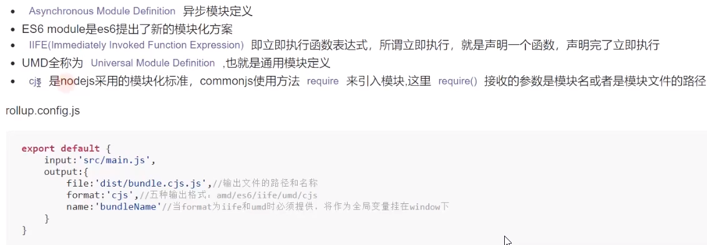

# rollup
- 下一代ES模块捆绑器
> 要用NODE 10版本以上进行打包，不然会报错
## 背景
- webpack打包繁琐，打包体积比较大
- rollup主要用来打包js库
## 安装
`npm i @babel/core @babel/preset-env @rollup/plugin-commonjs @rollup/plugin-node-resolve @rollup/plugin-typescript lodash rollup rollup-plugin-babel postcss rollup-plugin-postcss rollup-plugin-terser tslib typescript rollup-plugin-serve rollup-plugin-livereload -D`
## 初次使用
### rollup.config.js

```javascript
export default {
  input:'./src/main.js',
  output:{
    file:'./dist/bundle.js',
    format:'cjs',// 输出格式：amd,es6,iife,umd,cjs(node的方式，输入：require,输出：module.export)
    name:'bundleName'// 如果是iife和umd的话，需要指定一个全局变量名，后面通过window.bundleName进行访问
  }
}
```
#### cjs
```javascript
'use strict';
var index = "hellow";
module.exports = index;
```
#### es
```javascript
var index = "hellow";
export default index;
```
#### iife自执行函数
- library calculator
- library target var
```javascript
var calculator = (function () {
	'use strict';
	var index = "hellow";
	return index;
}());
```
#### umd
- cjs
- amd
- var
```javascript
(function (global, factory) {
	typeof exports === 'object' && typeof module !== 'undefined' ? module.exports = factory() :
	typeof define === 'function' && define.amd ? define(factory) :
	(global = typeof globalThis !== 'undefined' ? globalThis : global || self, global.calculator = factory());
}(this, (function () { 'use strict';

	var index = "hellow";

	return index;

})));

```
#### amd

### 插件
#### 支持babel
> 将es6转es5
- rollup-plugin-babel
- @babel/core
- @babel/preset-env

* 需要配置.babelrc文件
```javascript
{
  "presets":[
    [
      "@babel/env",
      {
        modules:false // 
      }
    ]
  ]
}
```
#### 使用第三方模块
> 模块引用默认只支持ES6方式，而大部分第三方包是cjs
- @rollup/plugin-commonjs 
- @rollup/plugin-node-resolve 

#### 使用TS
- tslib
- typescript
- @rollup/plugin-typescript

#### 压缩
- rollup-plugin-terser

#### css
> 将css打包到头部style内
- rollup-plugin-postcss

### ES模块语法
ES模块导出实时绑定的，而不是值
```javascript
// incrementer.js
export let count = 0;

export function increment() {
  count += 1;
}

// main.js
import { count, increment } from './incrementer.js';

console.log(count); // 0
increment();
console.log(count); // 1

count += 1; // Error — 只有 incrementer.js 可以改变这个值。
```

### 注意：
- 配置文件配置好，如果自己通过命令行形式参数改写了，就会覆盖配置文件的配置
- Rollup 本身会处理配置文件，所以可以使用 export default 语法——代码不会经过 Babel 等类似工具编译，所以只能使用所用 Node.js 版本支持的 ES2015 语法
- 如果愿意的话，也可以指定与默认 rollup.config.js 文件不同的配置文件
  - `rollup --config rollup.config.dev.js`
  - `rollup --config rollup.config.prod.js`
- 代码拆分和运行时态的动态导入 dynamic imports at runtime. 如果你的项目中更需要这些功能，那使用 Webpack可能更符合你的需求。

### tree-sharking
- 原理：作用域分析